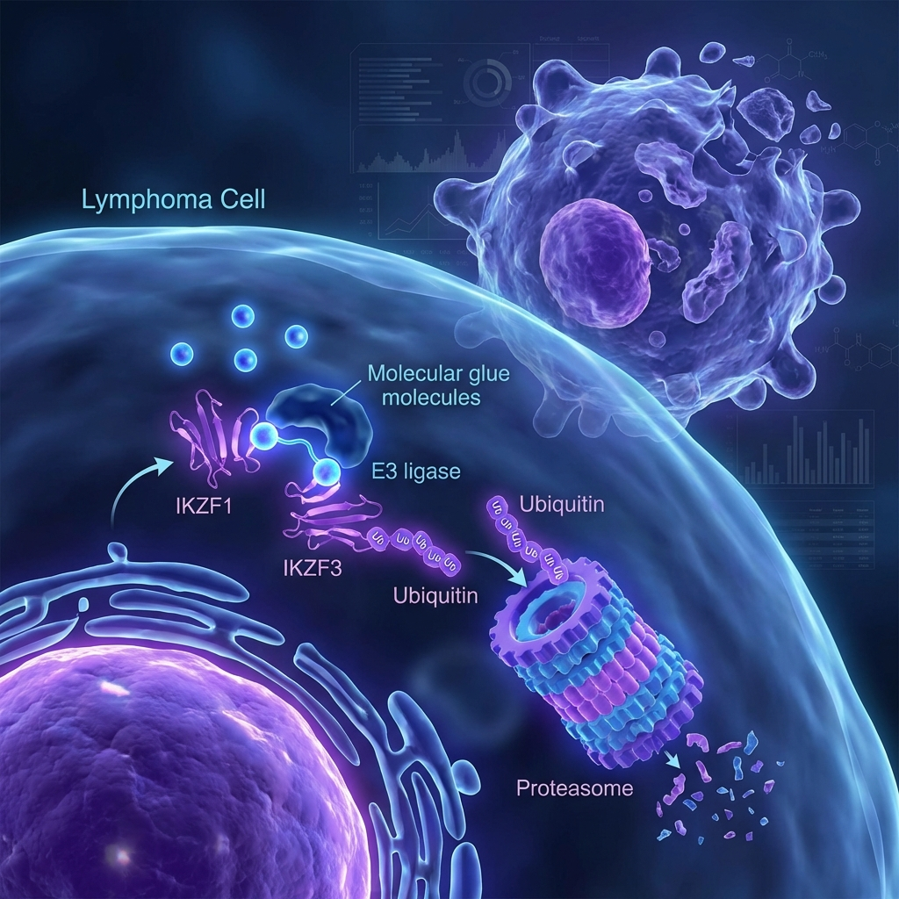

Excited to share that our work on **Golcadomide**, an oral CELMoD agent targeting IKZF1/3 for Diffuse Large B-Cell Lymphoma, has been published in *Blood Cancer Discovery*!

This study demonstrates how molecular glue degraders can selectively eliminate cancer cells by hijacking the ubiquitin-proteasome system.

